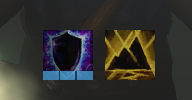

# ShamanForever

A configurable HUD for shamans on World of Warcraft: Forever: the buffs, imbues and cooldowns a shaman watches, as icons you can arrange anywhere.

> This addon was created by AI, with minimal oversight by a human. Feedback and requests are welcome.

## Features

- **Elements** for shields, shocks, weapon imbues and totem cooldowns, each with its own look and warning settings, and a live preview in the options. Water Shield tracking is experimental.
- **Totem bar**: your totems and their timers; left-click drops each element's picked totem, right-click dismisses it, and a picker changes the pick, in combat too. Call of the Elements and Totemic Recall buttons (right-click Recall to dismiss every totem), key bindings, and a flash when a totem is killed early. It can replace either or both of Blizzard's totem bars.
- **Warnings that catch the eye**: pulsing glows and pops for expiring totems, a lost imbue, and spells coming off cooldown.
- **Timers**: countdown text, swipe and time bar, each on or off and styled, for every cooldown and time left, with defaults for all and overrides per element.
- **Groups**: arrange elements into rows and columns, each with its own position, scale, opacity and border, or hide elements you don't use.
- **Combat aware**: show any element or group always, only in combat, or never. Everything stays accurate in combat using Blizzard's own display widgets (see [docs/combat-techniques.md](docs/combat-techniques.md)).

## Usage

- `/sf` opens the options window (also the minimap button, and under Escape > Options > AddOns). Right-click the minimap button to lock or unlock positioning.
- Key bindings for the totem bar: Escape > Options > Keybindings > Shaman Forever.
- `/sf lock` to unlock positioning and move and scale groups on screen (the bar that appears lists the controls), `/sf lock` again when done.

Requires WoW: Forever (interface 16001).

## More

- [CHANGELOG.md](CHANGELOG.md): what changed in each version.
- [docs/combat-techniques.md](docs/combat-techniques.md): how auras, totems and cooldowns are shown in combat, and the one inference the addon makes.
- [docs/releasing.md](docs/releasing.md): how a release is cut.

## Art

The options banners are public-domain paintings: Thomas Moran, *The Chasm of the Colorado*; Joseph Wright of Derby, *Vesuvius from Portici*; Frederic Edwin Church, *Rainy Season in the Tropics* and *Aurora Borealis*; Francisque Millet, *Mountain Landscape with Lightning*. The corner and divider ornaments are public domain / CC0 (Wikimedia Commons). Spell icons are Blizzard's, from the game.

## Licence

MIT, see LICENSE.
