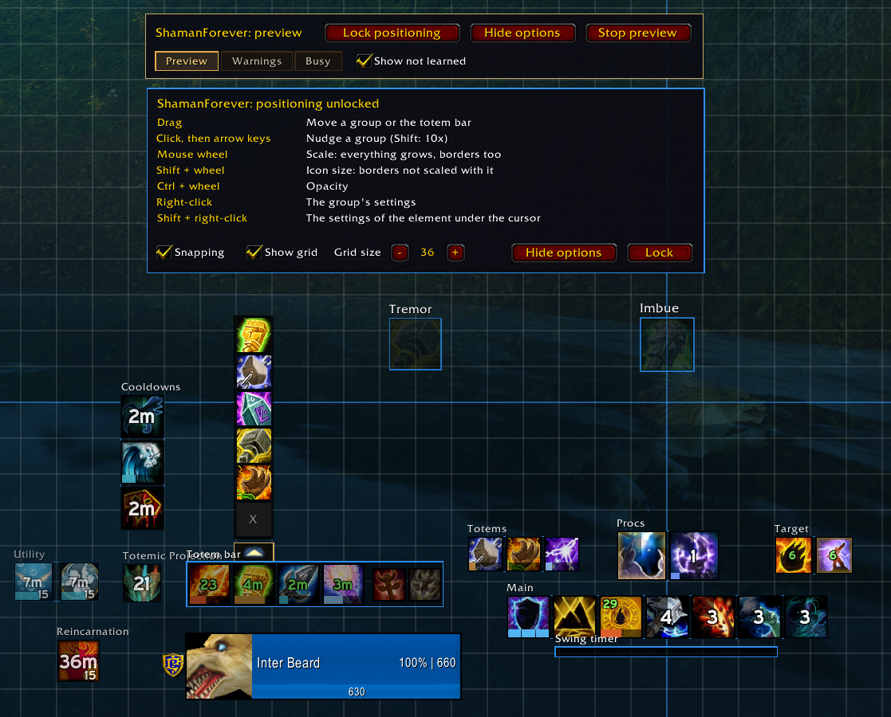

A configurable HUD for shamans on World of Warcraft: Forever: the buffs, imbues and cooldowns a shaman watches, as icons you can arrange anywhere. Requires WoW: Forever (interface 16001).

More screenshots: [options gallery](docs/gallery/README.md).

## Download

- [CurseForge](https://www.curseforge.com/wow/addons/shamanforever)
- [Wago](https://addons.wago.io/addons/shamanforever)
- [GitHub releases](https://github.com/cassidymichael/ShamanForever/releases)

## Features

A collection of highly configurable HUD elements designed to help shamans playing World of Warcraft: Forever.

- **Totem Bar**: Fully configurable totem bar replacing default or active totems frames: drop, pick and dismiss totems, Call of the Elements and Totemic Recall, an out-of-range warning, key bindings, themes, and more.
- **Shock Trackers**: Earth, Flame, and Frost shock monitoring.
- **Target Trackers**: Flame Shock on your target with its time left (a bar that changes colour near the end) and a look while it's missing, and Purge when your target has a Magic buff.
- **Shield Helpers**: Lightning Shield and Water Shield tracking.
- **Weapon Imbues**: Rockbiter, Flametongue, Frostbrand, and Windfury imbue status.
- **Swing Timer**: melee swing timer shown as a bar.
- **Spell Trackers**: Stormstrike, Fire Nova, Lava Burst, Chain Lightning, Riptide, Rage of the Farseer, Nature's Swiftness, Mana Tide Totem, each with the timers, bars, glows and pops that suit it.
- **Totem Trackers**: Earthbind, Tremor, Grounding, and Stoneclaw Totem helpers.
- **Utility Trackers**: Elemental Focus, Water Walking, Water Breathing, Maelstrom Weapon, Totemic Projection, Reincarnation.
- **Racial Trackers**: your race's racial abilities (experimental).
- **Text and Bars**: font, outline, shadow and bar texture for the HUD, from the game's or any that another addon shares through LibSharedMedia.
- **Styles explorer**: every border look, pulsing glow and pop side by side on one page; right-click one to use it.

The addon organizes these elements into configurable groups with unlock and preview modes for customizable on-screen placement. Each element can fade or hide while it's idle, for example a shock shown only while it cools down.

Some features are experimental: not fully tested, and may not work properly. The About page lists them.

## Usage

- `/sf` opens the options window (also the minimap button, and under Escape > Options > AddOns). Right-click the minimap button to lock or unlock positioning.
- Key bindings for the totem bar: Escape > Options > Keybindings > ShamanForever, or hover the bar in Quick Keybind Mode. Each button can show its key.
- `/sf lock` to unlock positioning and move and scale groups on screen (the bar that appears lists the controls), `/sf lock` again when done.
- `/sf preview` shows the whole HUD in a typical moment while you arrange it, `/sf preview` again to stop.

## Feedback

Ideas, requests or problems are welcome, any of these ways:

- A post in `#feedback` on [Discord](https://discord.gg/VaXH8CQZFG).
- A comment on [CurseForge](https://www.curseforge.com/wow/addons/shamanforever/comments).
- An [issue on GitHub](https://github.com/cassidymichael/ShamanForever/issues).

## Development

ShamanForever is created and maintained with the help of AI tools.

- [CHANGELOG.md](CHANGELOG.md): what changed in each version.
- [docs/releasing.md](docs/releasing.md): how work reaches main, and how a release is cut.

## Art

The options banners are public-domain paintings: Thomas Moran, *The Chasm of the Colorado*; Joseph Wright of Derby, *Vesuvius from Portici*; Frederic Edwin Church, *Rainy Season in the Tropics* and *Aurora Borealis*; Francisque Millet, *Mountain Landscape with Lightning*. The corner and divider ornaments are public domain / CC0 (Wikimedia Commons). The logo is Blizzard's shaman crest, redrawn, over the same paintings and Ivan Aivazovsky's *Breaking Wave*, with a CC0 wood texture from ambientCG. The link icons on the About page are from Simple Icons (CC0). Spell icons are Blizzard's, from the game, as is the art of the Cooldown Manager, Forever action button, Outer halo, Proc glow and Blizzard's flash looks. The Carved stone, Aged bronze and Carved wood borders and the Emblem pop burst were made with an AI image model (Google Gemini), as were the plinth and medallions of the Stone and bronze totem theme.

## Licence

MIT, see LICENSE.
