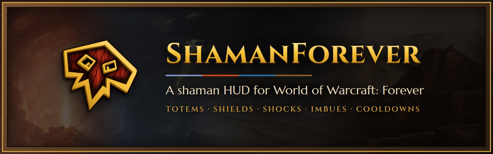
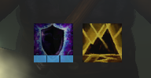

A configurable HUD for shamans on World of Warcraft: Forever: the buffs, imbues and cooldowns a shaman watches, as icons you can arrange anywhere. Requires WoW: Forever (interface 16001).

More screenshots: [options gallery](docs/gallery/README.md).

## Download

- [CurseForge](https://www.curseforge.com/wow/addons/shamanforever)
- [Wago](https://addons.wago.io/addons/shamanforever)
- [GitHub releases](https://github.com/cassidymichael/ShamanForever/releases)

## Features

A HUD for shamans on WoW: Forever, made of elements you arrange in groups anywhere on screen.

- **Totem bar**: drop, pick and dismiss totems, Call of the Elements and Totemic Recall, an out-of-range warning and key bindings. It can replace Blizzard's totem frames.
- **Shields**: Lightning Shield and Water Shield, their charges and time left.
- **Shocks**: Earth, Flame or Frost Shock, with range and mana.
- **Weapon Imbue**: Rockbiter, Flametongue, Frostbrand and Windfury.
- **Swing timer**: your next melee swing, on a bar of its own.
- **Cooldowns**: Fire Nova, Stormstrike, Lava Burst, Chain Lightning, Riptide, Nature's Swiftness, Rage of the Farseer, Totemic Projection and Reincarnation.
- **Totems**: Earthbind, Stoneclaw, Grounding, Mana Tide, and Tremor with a warning for mobs that fear, charm or sleep.
- **Buffs and procs**: Elemental Focus, Maelstrom Weapon, Water Walking and Water Breathing.
- Warnings, glows, pops and sounds, set once or per element; positioning and preview modes; profiles you can share.

Some elements are experimental, not yet tested in game; the About page lists them.

## Usage

- `/sf` opens the options window (also the minimap button, and under Escape > Options > AddOns). Right-click the minimap button to lock or unlock positioning.
- Key bindings for the totem bar: Escape > Options > Keybindings > ShamanForever, or hover the bar in Quick Keybind Mode. Each button can show its key.
- `/sf lock` to unlock positioning and move and scale groups on screen (the bar that appears lists the controls), `/sf lock` again when done.
- `/sf preview` shows the whole HUD in a typical moment while you arrange it, `/sf preview` again to stop.

## Feedback

Ideas, requests or problems are welcome, any of these ways:

- A post in `#feedback` on [Discord](https://discord.gg/VaXH8CQZFG).
- A comment on [CurseForge](https://www.curseforge.com/wow/addons/shamanforever/comments).
- An [issue on GitHub](https://github.com/cassidymichael/ShamanForever/issues).

## How it works

In combat, Forever hides most of what an addon could read about auras, totems and cooldowns. ShamanForever hands that information to Blizzard's own display widgets instead of reading it, and times the few things it can't see from your own casts, which stay readable.

## Development

ShamanForever is created and maintained with the help of AI tools.

- [CHANGELOG.md](CHANGELOG.md): what changed in each version.
- [docs/releasing.md](docs/releasing.md): how work reaches main, and how a release is cut.

## Art

The options banners are public-domain paintings: Thomas Moran, *The Chasm of the Colorado*; Joseph Wright of Derby, *Vesuvius from Portici*; Frederic Edwin Church, *Rainy Season in the Tropics* and *Aurora Borealis*; Francisque Millet, *Mountain Landscape with Lightning*. The corner and divider ornaments are public domain / CC0 (Wikimedia Commons). The logo is Blizzard's shaman crest, redrawn, over the same paintings and Ivan Aivazovsky's *Breaking Wave*, with a CC0 wood texture from ambientCG. The link icons on the About page are from Simple Icons (CC0). Spell icons are Blizzard's, from the game, as is the art of the Cooldown Manager, Forever action button, Outer halo, Proc glow and Blizzard's flash looks. The Carved stone, Aged bronze and Carved wood borders and the Painted bursts pop were made with an AI image model (Google Gemini).

## Licence

MIT, see LICENSE.
