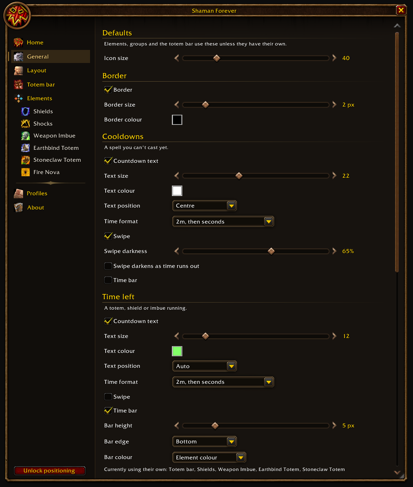
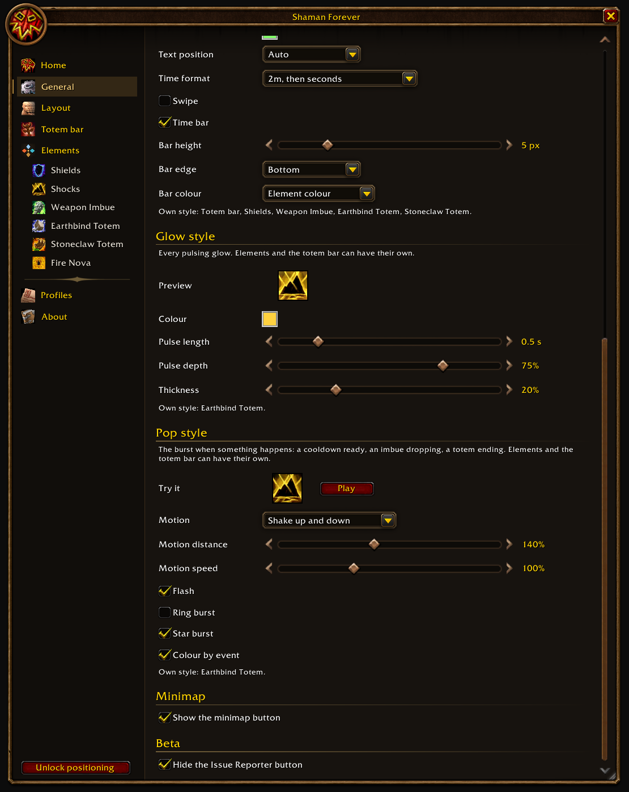
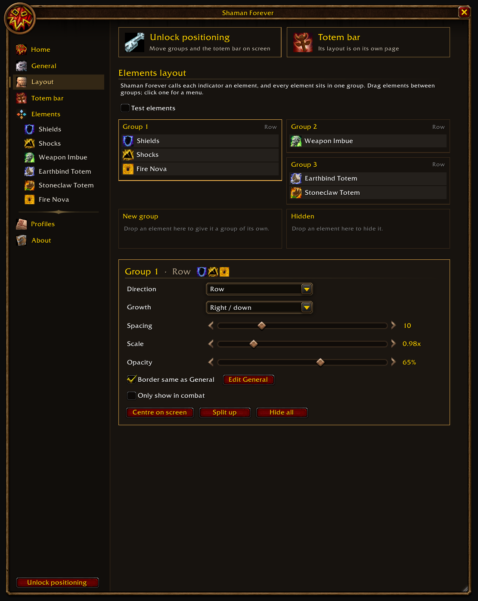
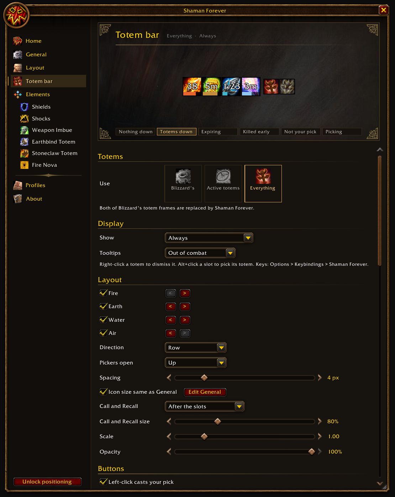
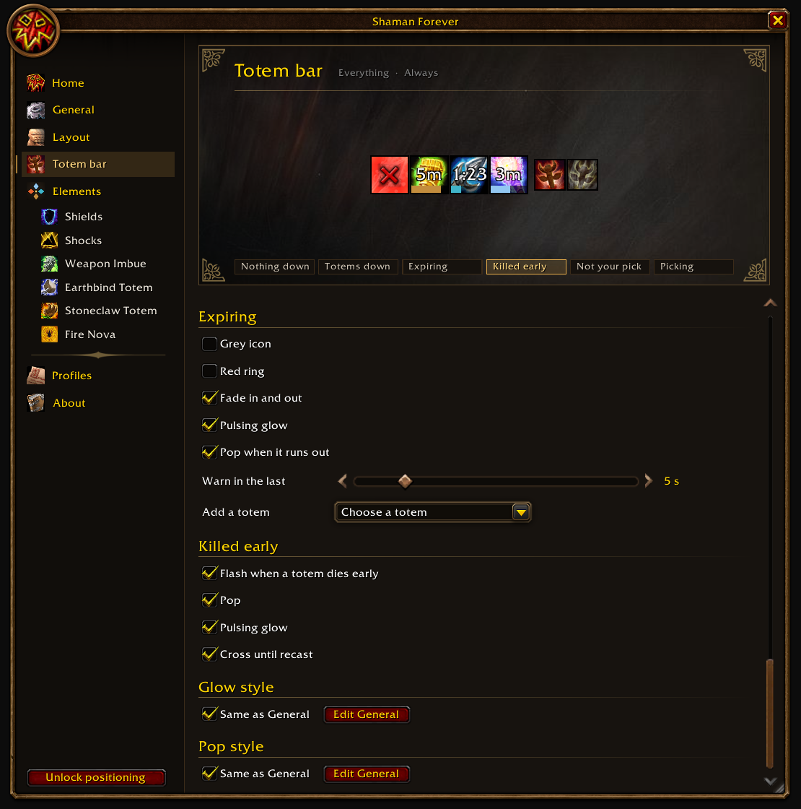
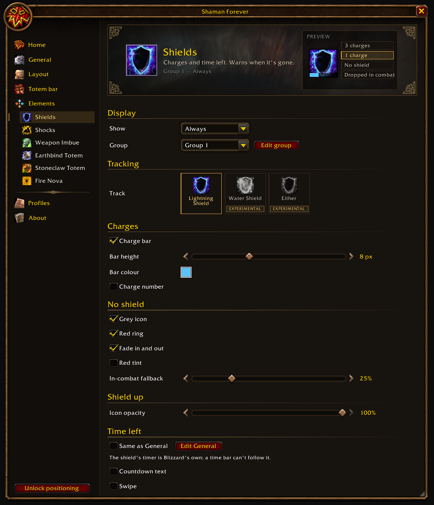
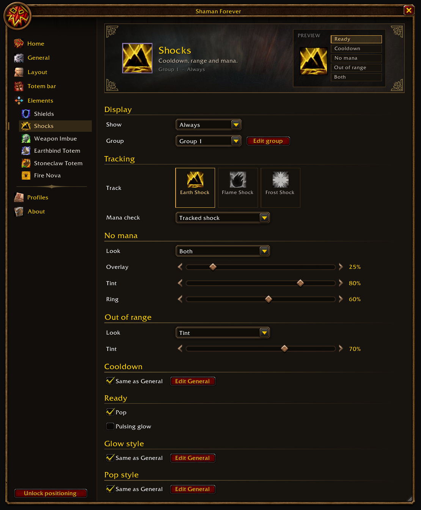
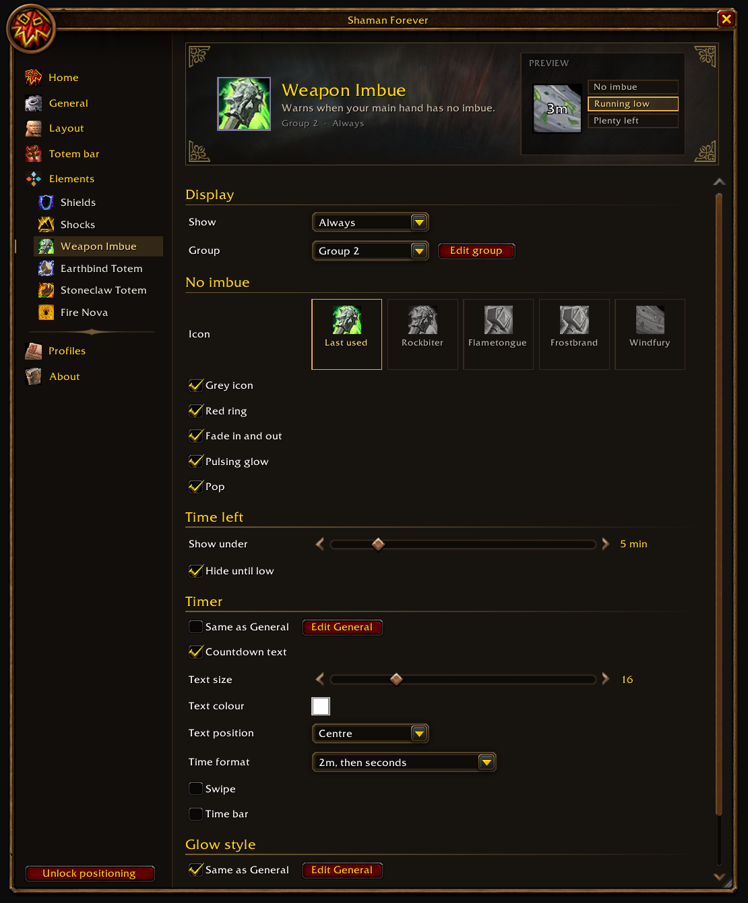
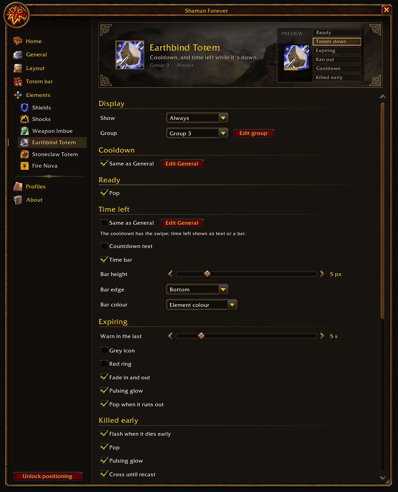
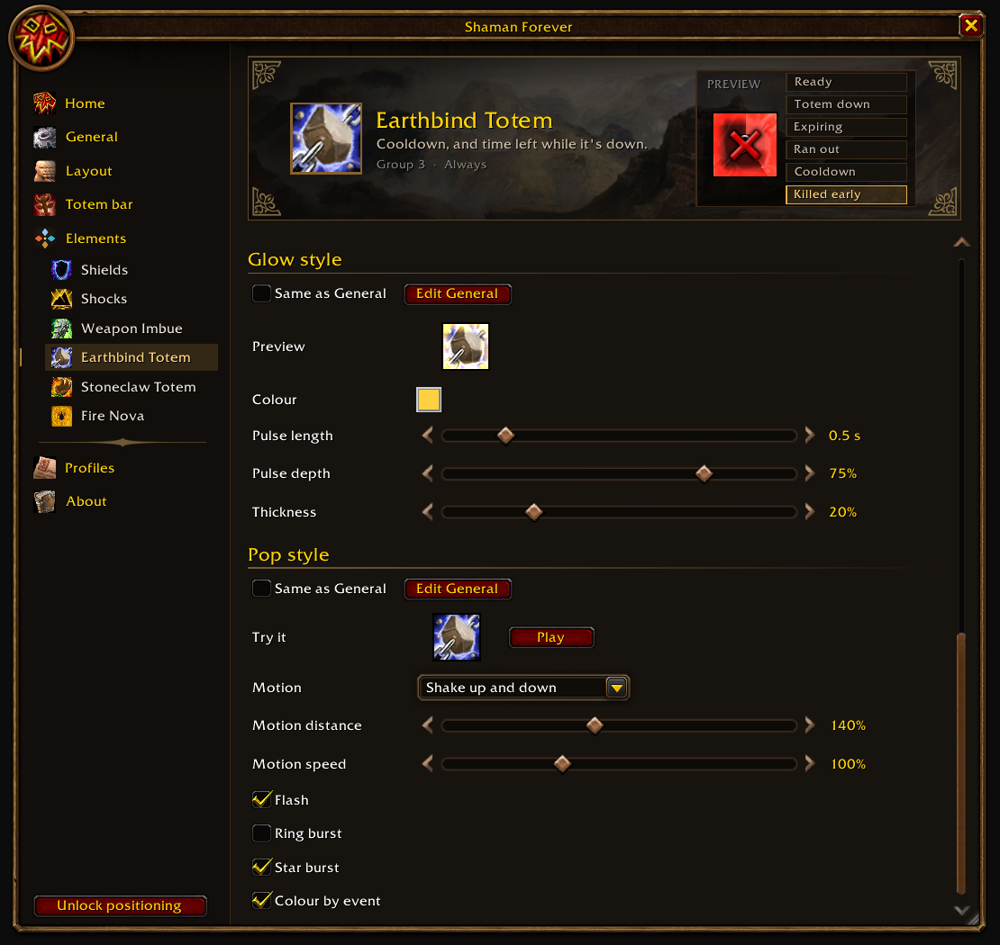

# Gallery

Screenshots of ShamanForever 0.6.2's options window, taken automatically in game on the World of
Warcraft: Forever beta. These images are not part of the addon download.

## General

## Layout

## Totem bar

## Shields

## Shocks

## Weapon Imbue

## Earthbind Totem

