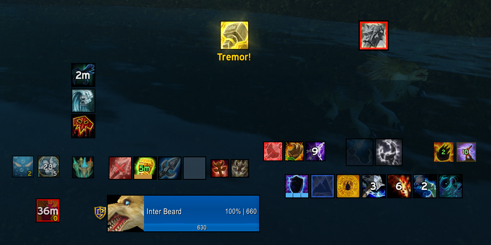
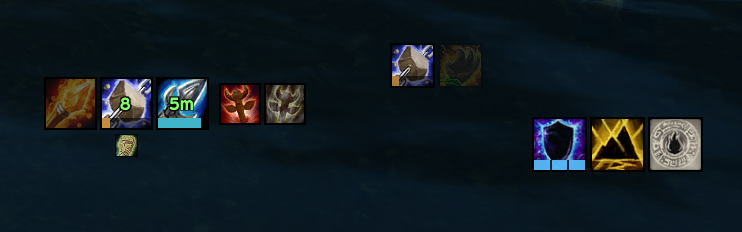

# Gallery

Screenshots of ShamanForever on the World of Warcraft: Forever beta: the HUD in game, and the
options window. The HUD shots are from 30 September 2026 and include features still in testing;
the options window shots are from 0.8.0. Features marked experimental aren't fully
tested yet. These images are not part of the addon download.

The options window shots are taken automatically in game, which is itself experimental: a shot can
start at an odd scroll position, and a few pages may be missing or out of order.

## On screen

## Home

## General

## Groups & Layout

## Totem bar

## Elements

## Shields

## Shocks

## Weapon Imbue

## Earthbind Totem

## Fire Nova

## Tremor Totem

## Mana Tide Totem (experimental)

## Nature's Swiftness (experimental)

## Reincarnation (experimental)

## Water Breathing (experimental)

## Elemental Focus (experimental)

## About

